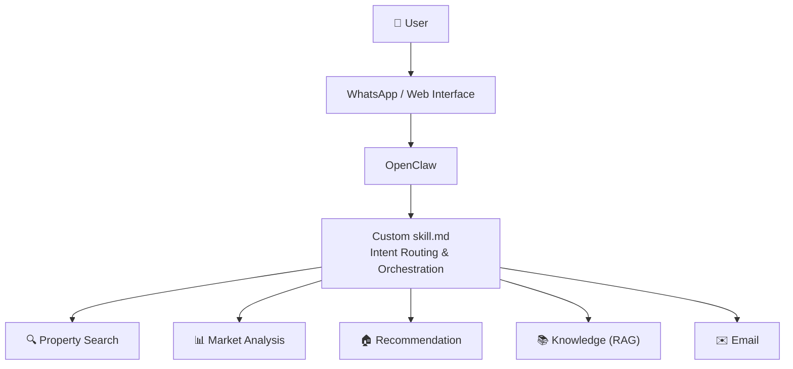

# Real Estate Multi-Agent AI Assistant

A multi-agent AI assistant for real-estate search and decision support in California. The system routes natural-language requests to specialized agents for property search, market analysis, recommendations,real-estate knowledge retrieval, and emailing service. This AI assistant currently is built on OpenClaw and WhatsApp

## Key Features

- **Conversational property search agent** -- Interpret property search requests, extract property information, retrieve matched listings through interactive conversation
- **Market analysis agent** -- Analyze california sold dataset to generate market insights based on users request
   - **Market metrics question** -- Detailed market data question, eg: "What is the average Days On Market in Irvine in the last 6 months"
   - **Market overview question** -- Questions about the general market situation, eg: "How is the market in Los Angeles"
   - **Market trend question** -- Questions about the market trend, eg: "Is the average close price rising in San Diego"
   - **Market condition question** -- Question about the market condition, giving users insights about some market features, eg: "Is Irvine a buyer or seller market"
- **Listing recommendation agent** -- Computes semantic similarity between a target property and candidate listings, and returns the top-ranked recommendations.
- **RAG knowledge agent** -- Answers real estate knowledge questions, such as "What does DOM stand for"
- **Email agent** -- Transform the agent response into email preview and actual email content that can be sent to users with user approval
- **Mixed-intent orchestration** -- The system can automatically identify the user intent and route the query into the corresponding agent
- **OpenClaw orchestration layer** -- The system uses OpenClaw as the orchestration layer 
- **WhatsApp interface** WhatsApp is connected with OpenClaw so it can serve as an interface that users will actually interact with all the agents

## 🏗️ System Architecture

## Future Improvements

Potential extensions include:

- stronger conversational memory
- model-based reranking
- richer recommendation explanations
- map-based property visualization
- authentication
- evaluation dashboards
- automated agent-level testing
- production monitoring and observability
