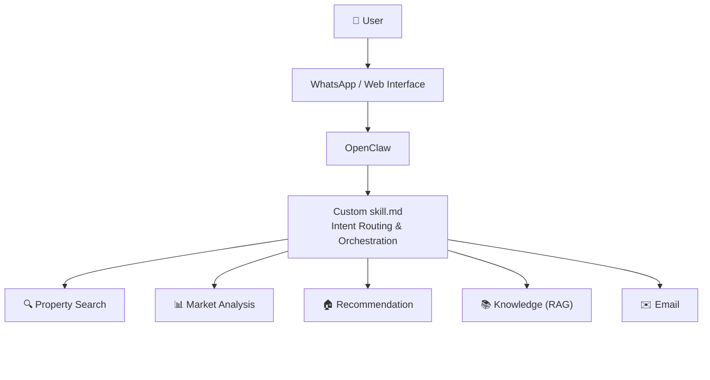

# 🏡 Real Estate Multi-Agent AI Assistant

A multi-agent AI assistant for real-estate search and decision support in California. The system routes natural-language requests to specialized agents for property search, market analysis, recommendations,real-estate knowledge retrieval, and emailing service. This AI assistant currently is built on OpenClaw and WhatsApp

## ✨ Key Features

- **🔍 Conversational property search agent** -- Interpret property search requests, extract property information, and retrieve matched listings through interactive conversation.

- **📊 Market analysis agent** -- Analyze California sold data to generate market insights based on user requests.
  - **📈 Market metrics question** -- Detailed market data question, eg: "What is the average Days On Market in Irvine in the last 6 months"
  - **🗺️ Market overview question** -- Questions about the general market situation, eg: "How is the market in Los Angeles"
  - **📉 Market trend question** -- Questions about the market trend, eg: "Is the average close price rising in San Diego"
  - **⚖️ Market condition question** -- Questions about market conditions, eg: "Is Irvine a buyer or seller market"

- **🏠 Listing recommendation agent** -- Computes semantic similarity between a target property and candidate listings, and returns the top-ranked recommendations.

- **📚 RAG knowledge agent** -- Answers real-estate knowledge questions, such as "What does DOM stand for"

- **✉️ Email agent** -- Transforms the agent response into an email preview and final email content that can be sent to users with user approval.

- **🧠 Mixed-intent orchestration** -- Automatically identifies user intent and routes the query to the corresponding agent.

- **⚙️ OpenClaw orchestration layer** -- Uses OpenClaw as the orchestration layer for coordinating the agent workflow.

- **💬 WhatsApp interface** -- Connects WhatsApp with OpenClaw so users can interact with the multi-agent system through messaging.


## 🏗️ System Architecture



## 💬 Agent Response Behavior

### 🔍 Property Search Agent
The property search agent collects four required fields before performing a search:

- **City**
- **Price range**
- **Number of bedrooms**
- **Number of bathrooms**

If any of these fields are missing from the user's original query, the agent will ask follow-up questions to collect the missing information before returning matching listings.

After the initial search results are returned, users can further refine the search with optional preferences such as **square footage, pool, view, property features, or other listing details**.

### 📊 Market Analysis Agent

The market analysis agent supports four types of market questions and automatically selects the appropriate analysis based on the user's query.

- **Market Metrics** — Directly returns the requested market statistic, such as average Days on Market (DOM), median close price, or average price per square foot.

- **Market Overview** — Provides a general snapshot of the selected market using key metrics such as:
  - Median close price
  - Average close price
  - Average Days on Market (DOM)
  - Average price per square foot
  - Average list-to-original-price ratio

- **Market Trend** — Returns market data for each month in the requested time range and calculates a **linear regression slope** for the relevant metric to summarize whether the overall trend is increasing, decreasing, or relatively stable.

- **Market Condition** — Supports several higher-level market questions:
  - **"Is the market competitive?"** — Determined using the list-to-original-price ratio. A ratio greater than `1.0` indicates a competitive market.
  - **"Is it a buyer's or seller's market?"** — Determined using average DOM:
    - `< 30 days` → Seller's market
    - `30–60 days` → Balanced market
    - `> 60 days` → Buyer's market
  - **"Is it a good time to buy?"** — Uses the most recent 3 months of data and evaluates trends in five indicators:
    - Close price
    - Average DOM
    - Price per square foot
    - List-to-original-price ratio
    - Sales count

    Buyer-favorable trends are falling prices, rising DOM, falling price per square foot, a falling list-to-original-price ratio, and falling sales volume. The agent combines these signals into an overall market-condition rating.

### 🏠 Recommendation Agent

- The recommendation agent finds listings that are similar to a target property.

- Users provide a **listing ID** from the original property dataset, and the agent uses that property as the reference listing to retrieve the **top-K most similar properties**.

- The value of **K** can be specified by the user. If no value is provided, the agent uses a default number of recommendations.

- The returned results are ranked by similarity to the target listing based on the property's available features.

### 📚 RAG Knowledge Agent

The RAG knowledge agent answers document-grounded questions about real-estate terminology, MLS fields, and dataset-specific definitions.

Example queries include:

- **"What does DOM mean?"**
- **"What is escrow?"**
- **"What are comps in real estate?"**
- **"What does cap rate mean?"**
- **"What does `ClosePrice` represent?"**
- **"What is the difference between `ClosePrice` and `L_SystemPrice`?"**
- **"What does `L_City` mean in the MLS dataset?"**

The agent retrieves relevant information from the indexed knowledge documents and uses that context to generate the response.

## 🗂️ Program Structure

The project is organized as a modular multi-agent system. Each agent is implemented as an independent component with its own source code, skill definition, tests, configuration, and supporting data.

```text
├── property-search-agent/
│   ├── src/                  # Core property search and filtering logic
│   ├── skill/                # OpenClaw skill definition
│   ├── tests/                # Property search agent tests
│   ├── package.json          # Agent dependencies and scripts
│   ├── package-lock.json     # Locked dependency versions
│   └── tsconfig.json         # Agent-specific TypeScript configuration
│
├── market-analysis-agent/
│   ├── src/                  # Market metrics, trends, overview, and condition analysis
│   ├── skill/                # OpenClaw skill definition
│   ├── tests/                # Market analysis agent tests
│   ├── package.json          # Agent dependencies and scripts
│   ├── package-lock.json     # Locked dependency versions
│   └── tsconfig.json         # Agent-specific TypeScript configuration
│
├── recommendation-engine-agent/
│   ├── src/                  # Listing similarity and Top-K recommendation logic
│   ├── skill/                # OpenClaw skill definition
│   ├── tests/                # Recommendation agent tests
│   ├── data/                 # Listing data and recommendation resources
│   ├── package.json          # Agent dependencies and scripts
│   ├── package-lock.json     # Locked dependency versions
│   └── tsconfig.json         # Agent-specific TypeScript configuration
│
├── RAG-knowledge-agent/
│   ├── src/                  # Document processing, retrieval, and answer generation
│   ├── skill/                # OpenClaw skill definition
│   ├── tests/                # RAG knowledge agent tests
│   ├── data/                 # Generated embeddings and retrieval indexes
│   ├── doc/                  # Source documents used for knowledge retrieval
│   ├── package.json          # Agent dependencies and scripts
│   ├── package-lock.json     # Locked dependency versions
│   └── tsconfig.json         # Agent-specific TypeScript configuration
│
├── Multi-agent-orchestration/
│   ├── src/                  # Intent routing and multi-agent orchestration logic
│   │   └── email/            # Email-related workflow and response handling
│   ├── skill/                # OpenClaw orchestration skill definition
│   ├── tests/                # Orchestration workflow tests
│   ├── package.json          # Orchestration dependencies and scripts
│   ├── package-lock.json     # Locked dependency versions
│   └── tsconfig.json         # Orchestration-specific TypeScript configuration
│
└── README.md                 # Project overview, architecture, and usage documentation
```

## 🚀 Future Improvements

### Persistent Conversation Memory for Property Search

- The current property search agent relies mainly on **OpenClaw's built-in session memory** to maintain the user's search context. The `SKILL.md` explicitly instructs OpenClaw to remember the user's current search criteria, and when the user provides additional preferences, the refined query is passed back to the property-search CLI for another search.

- A future improvement would be to introduce an external state store such as **Redis** to manage conversation memory directly within the agent. Search criteria such as city, price range, bedrooms, bathrooms, and optional preferences could be stored using a user or conversation identifier.

- This would allow the property search agent to preserve and update search context independently of OpenClaw's session memory, making the workflow more reliable and enabling search preferences to persist across separate sessions when appropriate.

### More Comprehensive Market Analysis

- The current market analysis agent supports a predefined set of market metrics and uses relatively simple rules to answer higher-level questions such as **"Is Irvine a buyer's or seller's market?"**

- A future improvement would be to build a more generalized market-analysis framework that combines a broader set of indicators and generates a more comprehensive market report. Instead of relying primarily on a single metric such as average Days on Market, the agent could jointly evaluate factors such as **inventory, sales volume, price trends, Days on Market, list-to-sale price ratio, price reductions, and months of supply**.

- This would allow the agent to provide more professional, evidence-based explanations for questions such as **"Is Irvine currently a buyer's or seller's market?"**, including the key indicators that support its conclusion rather than returning a classification based on a single rule.

### Reranking for More Precise RAG Retrieval

- The current RAG knowledge agent follows a standard retrieval pipeline: documents are **chunked**, converted into **embeddings**, and the most similar chunks are retrieved and passed to the model for answer generation.

- A future improvement would be to add a **reranking stage** after the initial retrieval. Instead of directly using the top results from embedding similarity, a reranker could evaluate the retrieved chunks again based on their relevance to the user's exact question and reorder or filter them before generation.

- This additional step could reduce less relevant context and provide the language model with a more focused set of supporting documents, improving the precision and reliability of the final response.

### Cloud Deployment and Scalability

- The current system runs locally, meaning the OpenClaw gateway, agent services, and database must remain active on the development machine for the service to be available.

- A future improvement would be to deploy the system to cloud infrastructure such as **AWS** so the agents can operate continuously without depending on a local computer. The OpenClaw gateway and agent services could be hosted on **EC2 or ECS**, while the local MySQL database could be migrated to **Amazon RDS**.

- As usage grows, the system could further introduce **Redis for persistent session state, load balancing, auto scaling, monitoring, and multiple agent workers** to support larger numbers of concurrent users and provide a more reliable 24/7 service.

### Standalone Full-Stack Web Application

- The current system uses OpenClaw and WhatsApp as the primary interaction layer. A future improvement would be to build a standalone full-stack web application that exposes the multi-agent system through a dedicated user interface and backend API.

- The web application could provide persistent user sessions, saved searches, structured property cards, market visualizations, and conversation history while allowing the orchestration and agent logic to operate independently of OpenClaw's session management.

- This would make the system easier to deploy as a standalone product, simplify public demonstrations, and provide greater control over scalability, authentication, state management, and user experience.